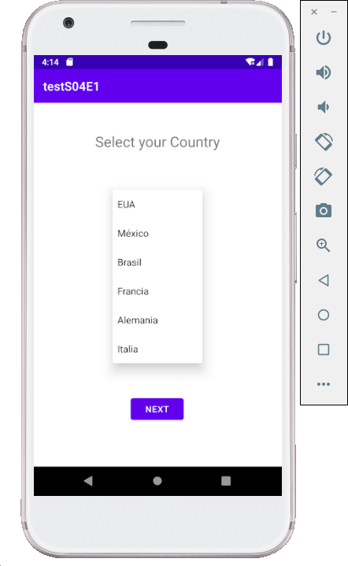

### Comprensión de Listas y Spinners

### Instrucciones

A partir del ejemplo visto en clase sobre spinners, en donde se lista una serie de países, debes realizar lo siguiente:

1. Se debe hacer uno de la pantalla de selección de país, al seleccionar el país, los textos de la pantalla deben cambiar al idioma del país seleccionado.
2. Al dar click al botón debe mandar un Alert con un mensaje de Bienvenida en el idioma que seleccionó.

  

