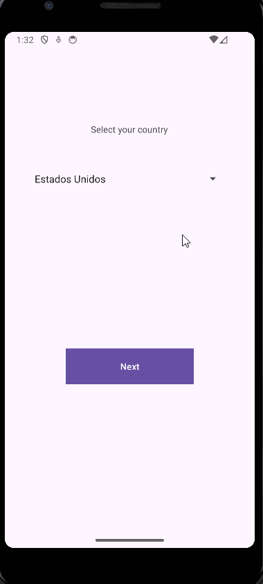

# Comprensión de Listas y Spinners

### Solución por Urtiz López Dan Jair

1. Se debe hacer uno de la pantalla de selección de país, al seleccionar el país, los textos de la pantalla deben cambiar al idioma del país seleccionado.
```kotlin
override fun onCreate(savedInstanceState: Bundle?) {
        super.onCreate(savedInstanceState)
        enableEdgeToEdge()
        setContentView(R.layout.activity_main)
        ViewCompat.setOnApplyWindowInsetsListener(findViewById(R.id.main)) { v, insets ->
            val systemBars = insets.getInsets(WindowInsetsCompat.Type.systemBars())
            v.setPadding(systemBars.left, systemBars.top, systemBars.right, systemBars.bottom)
            insets
        }

        val spinner = findViewById<Spinner>(R.id.spinner)
        val label = findViewById<TextView>(R.id.label)
        val button = findViewById<Button>(R.id.nextButton)

        spinner.onItemSelectedListener = object : AdapterView.OnItemSelectedListener {
            override fun onItemSelected(parent: AdapterView<*>, view: View?, position: Int, id: Long) {
                val selectedItem = parent.getItemAtPosition(position).toString()

                label.text = when(selectedItem) {
                    "Estados Unidos" -> "Select your country"
                    "México" -> "Selecciona tu país"
                    "Brasil" -> "Selecione seu país"
                    "Francia" -> "Sélectionnez votre pays"
                    "Alemania" -> "Wählen Sie Ihr Land"
                    "Italia" -> "Seleziona il tuo paese"
                    else -> "Unknown"
                }

                button.text = when(selectedItem) {
                    "Estados Unidos" -> "Next"
                    "México" -> "Siguiente"
                    "Brasil" -> "Próximo"
                    "Francia" -> "Suivant"
                    "Alemania" -> "Weiter"
                    "Italia" -> "Avanti"
                    else -> "Unknown"
                }

                country = selectedItem
            }

            override fun onNothingSelected(parent: AdapterView<*>) {
                // No implemented
            }
        }
    }
```
2. Al dar click al botón debe mandar un Alert con un mensaje de Bienvenida en el idioma que selecciono.
```kotlin
fun showAlertDialog(view: View) {
        val builder = AlertDialog.Builder(this)

        if (country == "Estados Unidos") {
            builder.setTitle("We welcome you!")
            builder.setMessage("This is a welcome message!")
            builder.show()
        } else if (country == "México") {
            builder.setTitle("¡Te damos la bienvenida!")
            builder.setMessage("Este es un mensaje de bienvenida")
            builder.show()
        } else if (country == "Brasil") {
            builder.setTitle("Seja bem-vindo!")
            builder.setMessage("Esta é uma mensagem de boas-vindas")
            builder.show()
        } else if (country == "Francia") {
            builder.setTitle("Nous vous souhaitons la bienvenue !")
            builder.setMessage("C'est un message de bienvenue")
            builder.show()
        } else if (country == "Alemania") {
            builder.setTitle("Wir heißen Sie willkommen!")
            builder.setMessage("Dies ist eine willkommene Nachricht")
            builder.show()
        } else if (country == "Italia") {
            builder.setTitle("Vi diamo il benvenuto!")
            builder.setMessage("Questo è un messaggio di benvenuto")
            builder.show()
        }
    }
```
La pantalla final tiene que quedar así (solución):
<p align="center">
  
</p>
