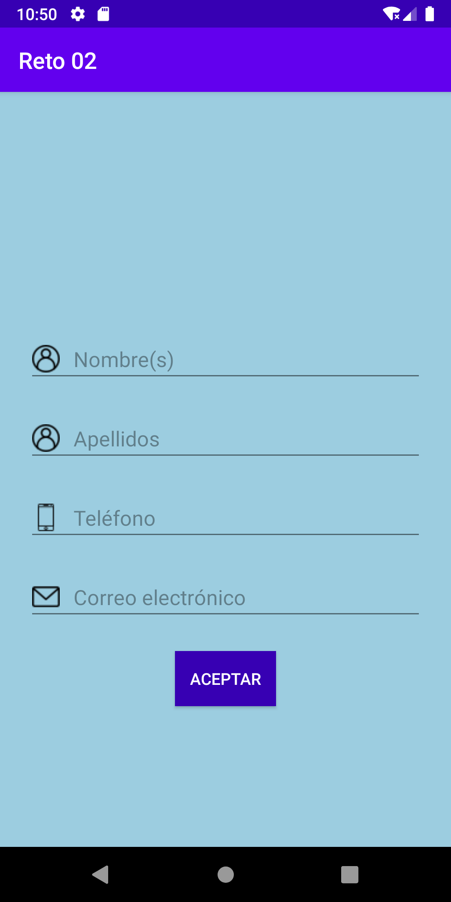

### Understanding: Views, Button, Inputs and Images

### Instructions

**_Note_**: *To perform this activity it is necessary to continue with the exercise done in class and follow the following instructions.

1. Change the color of the following elements:
    - The background of the layout in a blue tone.
    - The letters of the `TextView` and `Button` in gray color (use the `textColor` attribute).
2. The content of a `Button` is its text. Increase the button spacing by 8dp vertically and 16dp horizontally.
3. When the user presses the button, the button must be disabled (boolean enabled attribute) and the text must be made invisible (`visibility` attribute with `View.VISIBLE`, `View.INVISIBLE` and `View.GONE` values).
4. Create an application whose interface has the following layout:

  

5. When the user presses ACCEPT, the following two cases should exist.

a) No field is empty: an image with a green checkmark will be displayed as a sign of successful authentication.

b) One or all fields are empty: an image with a red dove will be displayed as a sign of authentication error.
