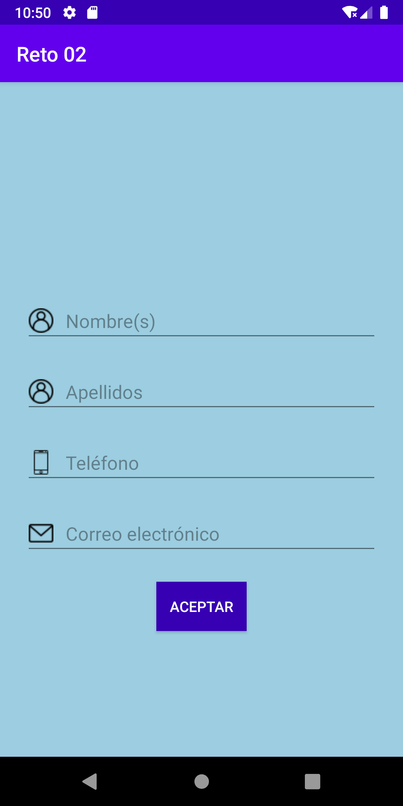
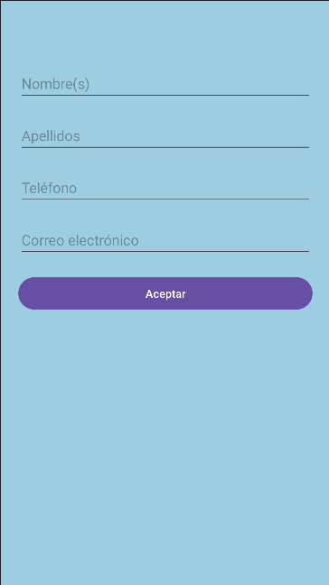
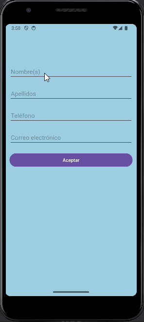

# Comprensión: Views, Button, Inputs e Imágenes

### Instrucciones

**_Nota_**: *Para realizar este actividad es necesario continuar con el ejercicio realizado en clase y seguir las siguientes instrucciones.*

1. Cambiar de color de los siguientes elementos:
    - El background del layout en un tono azul.
    - Las letras del `TextView` y `Button` color gris (usar el atributo `textColor`).
````xml
<androidx.constraintlayout.widget.ConstraintLayout xmlns:android="http://schemas.android.com/apk/res/android"
    xmlns:app="http://schemas.android.com/apk/res-auto"
    xmlns:tools="http://schemas.android.com/tools"
    android:id="@+id/main"
    android:layout_width="match_parent"
    android:layout_height="match_parent"
    android:background="#9CCDE0" 
    tools:context=".MainActivity">
...
</androidx.constraintlayout.widget.ConstraintLayout>
````
2. El contenido de un `Button` es su texto. Aumentar el espacio del botón en 8dp verticalmente y 16dp horizontalmente.
3. Cuando el usuario pulse el botón, este debe deshabilitarse (atributo enabled tipo booleano) y el texto debe hacerse invisible (atributo `visibility` con valores `View.VISIBLE`, `View.INVISIBLE`  y `View.GONE`)
```kotlin
fun checkUserInput(view: View): Unit {
        // ...
        view.isEnabled = false
}
```
4. Crear una aplicación cuya interfaz tenga el siguiente diseño:
<p align="center">
  
</p>

## Mi diseño

<p align="center">
  
</p>
5. Cuando el usuario pulse ACEPTAR, deberán existir los siguientes dos casos.

a) Ningún campo está vacío: se mostrará una imagen con una palomita verde en señal de autenticación correcta.

b) Uno o todos los campos están vacíos: se mostrará una imagen con una paloma roja en señal de error de autenticación.
<p align="center">
  
</p>

```kotlin
fun checkUserInput(view: View): Unit {
        nameTextField = findViewById(R.id.nameTextField)
        lastnameTextField = findViewById(R.id.lastnameTextField)
        phoneTextField = findViewById(R.id.phoneTextField)
        emailTextField = findViewById(R.id.emailTextField)
        errorImageView = findViewById(R.id.errorImageView)
        checkImageView = findViewById(R.id.checkImageView)

        val name = nameTextField.text.toString()
        val lastname = lastnameTextField.text.toString()
        val phone = phoneTextField.text.toString()
        val email = emailTextField.text.toString()

        if (name.isEmpty()  || lastname.isEmpty() || phone.isEmpty() || email.isEmpty()) {
            errorImageView.visibility = View.VISIBLE

            if (checkImageView.visibility == View.VISIBLE) {
                checkImageView.visibility = View.GONE
            }
        } else {
            checkImageView.visibility = View.VISIBLE

            if (errorImageView.visibility == View.VISIBLE) {
                errorImageView.visibility = View.GONE
            }
        }
    }
```
