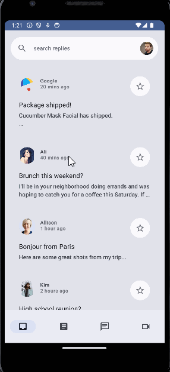
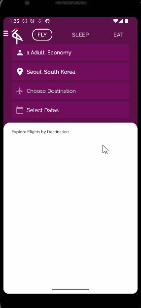
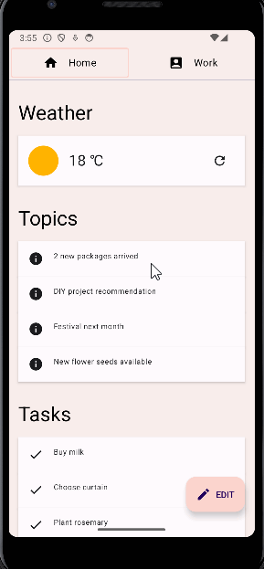
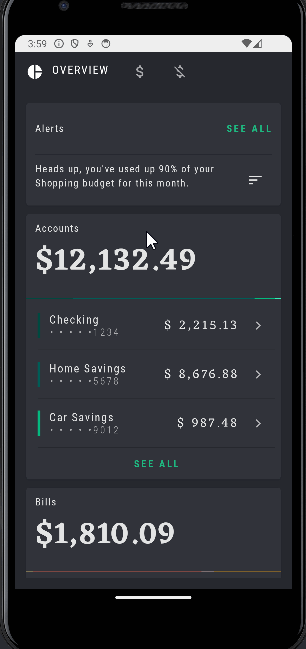

# Comprensión: Persistencia de Datos

### Instrucciones

Implementa diseños más avanzados y agrega estilo y movimiento a tu app. Aprenderás sobre las diversas APIs de Compose Animation, cómo implementar Material Design 3, cómo usar diseños personalizados para implementar diseños complejos y cómo usar diseños diferidos para crear IUs de buen rendimiento.

Sigue las instrucciones del siguiente CodeLab: https://developer.android.com/codelabs/jetpack-compose-theming?hl=es-419&continue=https%3A%2F%2Fdeveloper.android.com%2Fcourses%2Fpathways%2Fjetpack-compose-for-android-developers-2%3Fhl%3Des-419%23codelab-https%3A%2F%2Fdeveloper.android.com%2Fcodelabs%2Fjetpack-compose-theming#0

Codelab: Temas en Compose con Material 3

1. Accessibility Codelab

  

2. Adaptive UI

  

3. Advanced State

  

4. Animation

  

5. Navegation

  

